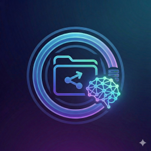

# SSH FS Plus



[](https://github.com/DavidLouda/vscode-sshfs-plus/releases)
[](LICENSE.txt)

> **Enhanced & maintained fork of [SSH FS](https://github.com/SchoofsKelvin/vscode-sshfs) by [Kelvin Schoofs](https://github.com/SchoofsKelvin)**

This extension allows mounting remote folders as local workspace folders, launch integrated remote terminals and run `ssh-shell` tasks.

### What's new in SSH FS Plus

- **React 18** — webview UI upgraded from React 17 to React 18
- **ESLint** — migrated from deprecated TSLint to ESLint with `@typescript-eslint`
- **`extensionKind: ["ui", "workspace"]`** — runs in the local UI host, keeping MCP / Copilot traffic local
- **Auto-reconnect** — connections automatically re-establish after unexpected disconnects
- **Dynamic extension ID** — no more hard-coded publisher; works under any publisher name
- **Bug fixes** — fixed `replaceVariablesRecursive` misuse, `quickPickItemTooltip` proposed-API crash, and more
- **Dependency updates** — ssh2 1.16, TypeScript 5.7, Yarn 4.6, VS Code engine ≥ 1.90

## Installation

1. Download the latest `.vsix` from [Releases](https://github.com/DavidLouda/vscode-sshfs-plus/releases)
2. In VS Code: **Extensions** → **⋯** → **Install from VSIX…**
3. Reload VS Code

## Features

### Config editor

The built-in config editor makes it easy to create and edit configurations:


The config editors stores this, by default, in your User Settings (`settings.json`) as:

```json
"sshfs.configs": [
    {
        "name": "hetzner",
        "putty": "Hetzner",
        "label": "Hetzner",
        "hop": "hetzner2",
        "root": "/root"
    }
],
```

This config is configured to copy settings (e.g. username, host, ...) from my PuTTY session. Due to me having loaded my private key in Pageant (PuTTY's agent), this config allows me to create a connection without having to provide a password/passphrase. It also specifies that all file operations _(`ssh://hetzner/some/file.js`)_ are relative to the `/root` directory on the server.

Configurations are read from your global User Settings, the current workspace's settings, and any JSON files configured with `sshfs.configpaths`. Even when the workspace overrides this setting, the globally-configured paths will still be read. The workspace versions do have higher priority for merging or ignoring duplicates.

### Terminals

Using a simple button or the command palette, a remote terminal can be started:


_Uses `$SHELL` by default to launch your default user shell. A config option exists to change this, e.g. `"ksh -"` or `"exec .special-profile; $SHELL"`_

If a connection is already opened for a configuration, there is no need to reauthenticate. As long as the configuration hasn't changed, existing connections (both for workspace folders and terminals) will be reused.

### Remote shell tasks

A new task type `ssh-shell` is added to run shell commands remotely:


The task terminal opens a full PTY terminal on the server.

### Remote workspace folders

Using a simple button or the command palette, we can mount a remote workspace folder as a regular local workspace folder:


_Same configuration used as from the [Config editor](#Config editor) above._

This works seamlessly with extensions using the `vscode.workspace.fs` API _(added in VS Code 1.37.0)_, although not all extensions switched over, especially ones making use of binary files.

As can be seen, right-clicking a remote directory gives the option to instantly open a remote terminal in this directory.

The extension supports any `ssh://` URI. I actually opened `ssh://hetzner/ng-ui` as my folder, which resolves to `/root/ng-ui` on my remote server. By default, the button/command opens `ssh://hetzner/` which would then mount `/root`, as that is what my `Root` config field is set to. You can set it to whatever, including `~/path`.

### Miscellaneous

The extension comes with a bunch of other improvements/features. Internally the [ssh2](https://www.npmjs.com/package/ssh2) package is used. The raw config JSON objects _(as seen in [Config editor](#Config editor))_ is, apart from some special fields, a one-on-one mapping of the config options supported by this package. Power users can edit their `settings.json` to e.g. make use of the `algorithms.cipher` field to specify a list of ciphers to use.

Some other features worth mentioning:

#### Prompt host/username/password/... for every connection


Active connections are reused to minimize prompts. A connection gets closed if there's no terminal or file system using it for over 5 seconds.

#### Proxy settings

Several proxy types (SSH hopping, HTTP and SOCKS 4/5) are supported:


`SSH Hop` refers to using another configuration to hop through, similar to OpenSSH's `ProxyJump`:


#### SFTP Command/Sudo and Terminal command


The extension supports using a custom `sftp` subsystem command. By default, it uses the `sftp` subsystem as indicated by the remote SSH server. In reality, this usually results in `/usr/lib/openssh/sftp-server` being used.

The `SFTP Command` setting allows specifying to use a certain command instead of the default subsystem. The `SFTP Sudo` setting makes the extension try to create a sudo shell _(for the given user, or whatever sudo defaults to)_ and run `SFTP Command` _(or `/usr/lib/openssh/sftp-server` by default)_. For most users, setting this to `<Default>` should allow operating on the remote file system as `root`. Power users with esoteric setups can resort to changing `SFTP Command` to e.g. `sudo /some-sftp-server`, but might run into trouble with password prompts.

The `Terminal command` option, as mentioned in [Terminals](#terminals), allows overriding the command used to launch the remote shell. By default, the extension launches a remote shell over the SSH connection, runs `cd ...` if necessary, followed by `$SHELL` to start the user's default shell. This config option allows to replace this `$SHELL` with a custom way way of starting the shell, or configuring the provided default SSH shell.

## Links

- [GitHub (this fork)](https://github.com/DavidLouda/vscode-sshfs-plus) ([Issues](https://github.com/DavidLouda/vscode-sshfs-plus/issues) | [Releases](https://github.com/DavidLouda/vscode-sshfs-plus/releases))
- [Original SSH FS by Kelvin Schoofs](https://github.com/SchoofsKelvin/vscode-sshfs) ([VS Marketplace](https://marketplace.visualstudio.com/items?itemName=Kelvin.vscode-sshfs) | [Open VSX](https://open-vsx.org/extension/Kelvin/vscode-sshfs))

## Credits

This project is a fork of **[SSH FS](https://github.com/SchoofsKelvin/vscode-sshfs)** created by **[Kelvin Schoofs](https://github.com/SchoofsKelvin)**, licensed under [GPL-3.0](LICENSE.txt).  
All original code and design credit belongs to Kelvin Schoofs. This fork adds modernization, bug fixes and quality-of-life improvements on top of the original work.
